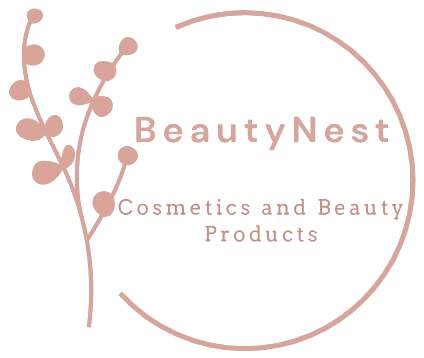
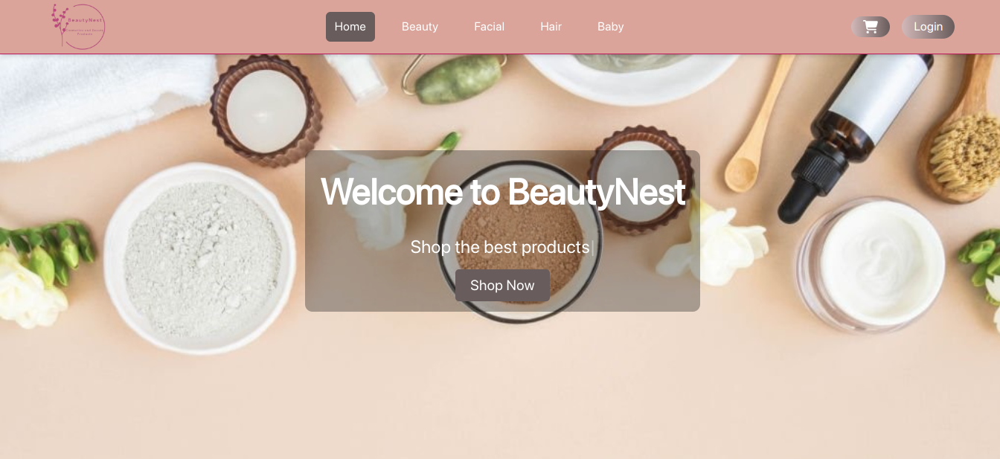
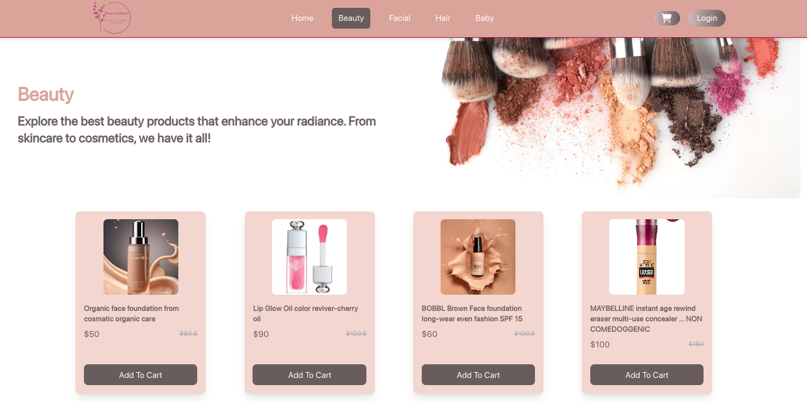
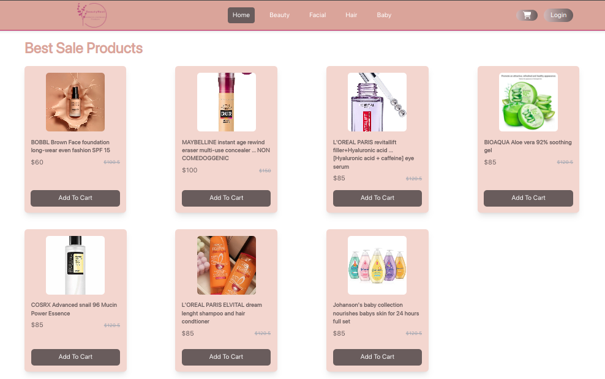
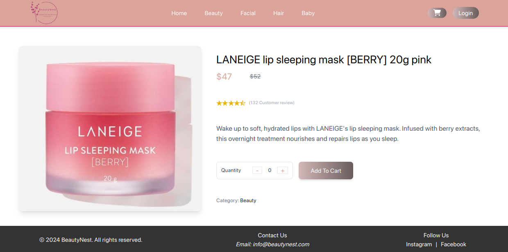

## Table of Contents
1. [Overview](#overview)
2. [Features](#features)
3. [Technologies Used](#technologies-used)
4. [Installation](#installation)
5. [Pages and Routes](#pages-and-routes)
6. [Customization](#customization)
7. [Screenshots](#screenshots)
8. [Contact](#contact)

## Overview
**BeautyNest** is a sleek, modern e-commerce platform designed for beauty and self-care products. It offers a seamless user experience, allowing users to browse through various categories such as beauty, facial care, hair care, and baby products. The project uses modern web development technologies, ensuring responsiveness and ease of use.

## Features
- **Product Categories**: Beauty, Facial, Hair, Baby.
- **Shopping Cart**: Add/delete and view products easily.
- **User Authentication**: Login/sign up using email and Google.
- **Dynamic UI**: Responsive design with Tailwind CSS and React.

## Technologies Used
- **React.js**: JavaScript library for building the user interface.
- **Firebase Authentication**: For user authentication (email, Google login).
- **React Router**: Navigation and routing.
- **Tailwind CSS**: Utility-first CSS framework for styling.
- **Framer Motion & AOS**: Animations for UI elements.
- **Toastify**: Display toast notifications for user actions.
- **Vite**: Fast build tool for development.

## Installation

1. Clone the repository:
   ```bash
   git clone https://github.com/Aalaa-Fahim/BeautyNest.git
   ```
2. Navigate into the project directory:
   ```bash
   cd BeautyNest
   ```
3. Install dependencies:
   ```bash
   npm install
   ```
4. Start the development server:
   ```bash
   npm run dev
   ```

## Pages and Routes
- **Home**: Displays the main product categories.
- **Beauty/Facial/Hair/Baby**: Each category page has a unique description and product listings.
- **Product**: Detailed view of each product.
- **Store**: To view all products and easily shop.
- **Cart**: View and manage products in the shopping cart.
- **Login/Signup**: User authentication system.

## Customization
### Adding Product Categories
To add or modify product categories, update the `StoreCategory` component and its routes within `App.js`. You can pass new banners and descriptions for each category.

### Animations
Animations are controlled using **Framer Motion** and **AOS**. To customize animations, you can tweak the configurations inside the respective components.

## Screenshots
| Page | Screenshot |
|------|------------|
| Home |  |
| Beauty |  |
| Products |  |
| Cart |  |

## Contact

For questions, feedback, or contributions, feel free to reach out:

- **Aalaa Fahim**: [LinkedIn](https://www.linkedin.com/in/aalaa-fahim) | [GitHub](https://github.com/Aalaa-Fahim)
- **Reham Saeed**: [LinkedIn](https://www.linkedin.com/in/reham-bahaa) | [GitHub](https://github.com/reham128)
